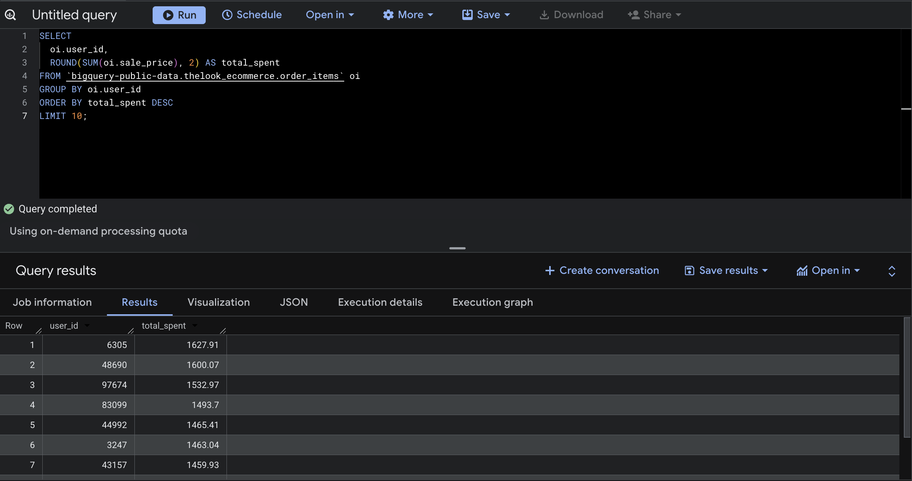
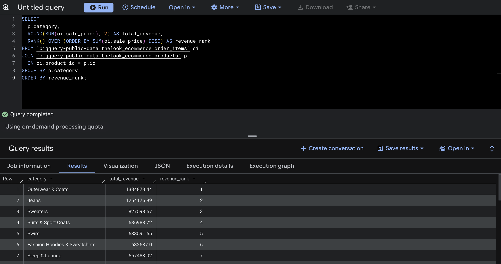
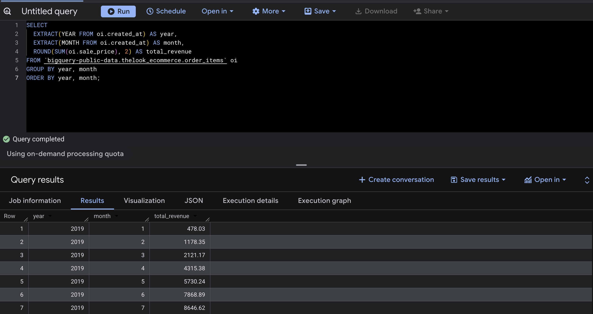
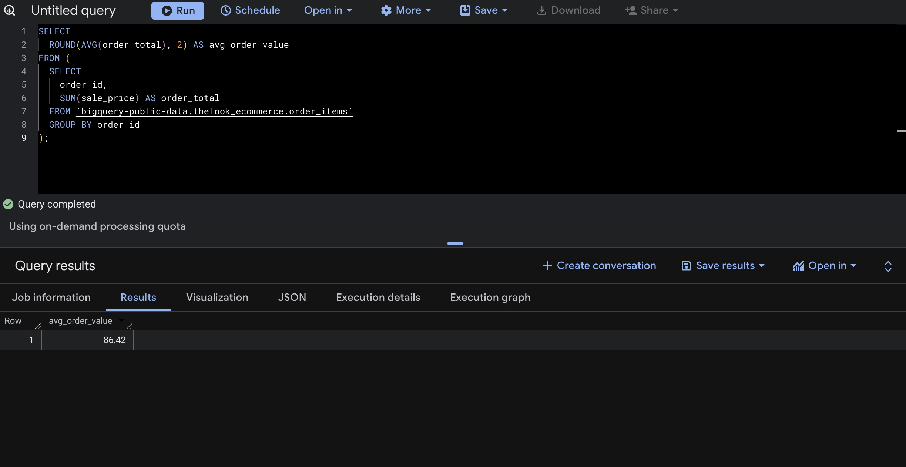

# E-Commerce SQL Analysis (Google BigQuery)

This project analyzes customer behavior and revenue performance using SQL on the Google BigQuery public dataset (thelook_ecommerce).

## Objective
To understand what drives revenue in an e-commerce platform by analyzing:
- Customer spending behavior
- Product performance
- Revenue trends over time

## Key Insights
- Top customers contribute significantly to total revenue
- Outerwear & Coats is the highest revenue-generating category
- Revenue shows consistent growth over time
- High-value products drive stronger revenue performance

## SQL Skills Demonstrated
- Aggregations (SUM, AVG)
- Joins across multiple tables
- Window functions (RANK)
- Grouping and filtering
- Subqueries

## Queries Included
1. Top Customers by Total Spend  
2. Top Products by Revenue  
3. Monthly Revenue Trend  
4. Revenue by Category (Ranked)  
5. Average Order Value

## Key Insights
- Top customers contribute significantly to total revenue, indicating high-value user segments
- Outerwear & Coats is the highest revenue-generating category, suggesting strong product demand
- Revenue shows consistent growth over time, indicating positive sales trends
- High-value products drive stronger revenue performance, highlighting pricing impact

## Dataset
Google BigQuery Public Dataset: thelook_ecommerce

## Sample Outputs

### Top Customers by Spend

### Revenue by Category

### Monthly Revenue Trend

### Average Order Value

## Tools Used
- SQL (Google BigQuery)
